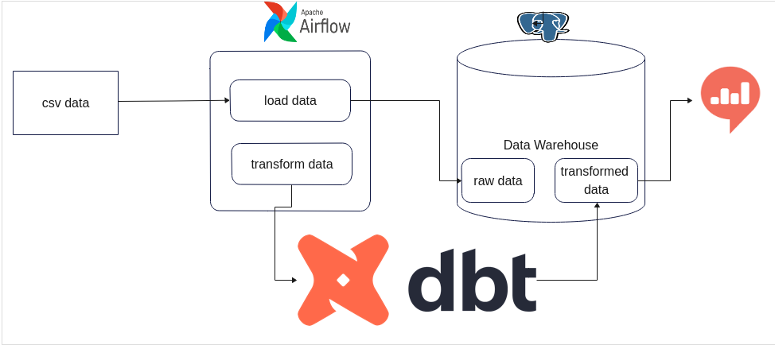

# traffic-data-pipeline-and-warehouse

**Table of content**

[traffic-data-pipeline-and-warehouse](#traffic-data-pipeline-and-warehouse)

- [Introduction](#Introduction)
- [Included Technologies and tools](#Included-Technologies-and-tools)
- [Dev setup](#Dev-setup)
- [Root folder](#Root-folder)
- [Project Structure](#project-structure)
  - [airflow](#airflow)
  - [data](#data)
  - [dbt](#dbt)
  - [images](#images)
  - [notebooks](#notebooks)

## Introduction

A city traffic department wants to collect traffic data using swarm UAVs (drones) from a number of locations in the city and use the data collected for improving traffic flow in the city and for a number of other undisclosed projects. Your startup is responsible for creating a scalable data warehouse that will host the vehicle trajectory data extracted by analysing footage taken by swarm drones and static roadside cameras.The data warehouse should take into account future needs, organise data such that a number of downstream projects query the data efficiently. You should use the Extract Load Transform (ELT) framework using DBT.

## Included-Technologies-and-tools

Apache Airflow - A workflow manager to schedule, orchestrate & monitor workflows. Directed acyclic graphs (DAG) are used by Airflow to control workflow orchestration.

Postgresql - is an object-relational database management system (ORDBMS) with an emphasis on extensibility and standards compliance. It is used as the primary data 
store or data warehouse for many webs, mobile, geospatial, and analytics applications.

DBT (data build tool) - enables transforming data in warehouses by simply writing select statements. It handles turning these select statements into tables and views.

Redash - is an open-source web application. It's used for clearing databases and visualizing the results.

## Dev-setup

  Clone this repo

      https://github.com/tesfayealex/traffic-data-pipeline-and-warehouse

  Install python requirements

      cd  traffic-data-pipeline-and-warehouse
      pip install -r requirements

  Install Docker , Docker compose and Redash

      ./setup.sh

  Initialize airflow with docker-compose

      docker-compose up

## Root-folder:

- `README.md`: Markdown text with a brief explanation of the project and the repository structure.
- `Dockerfile`: build users can create an automated build that executes several command-line instructions in a container.
- `setup.sh`: Docker installer for redash including docker and docker-compose installer
- `docker-compose`: Docker compose for airflow
- `requirements`: Python requirements to run the project 

## Project Structure

The Project uses a truffle unbox structure and follows

### airflow

This folder holds airflow dags and sql queries

### dbt

This folder holds queries in dbt and sql queries

### data

This folder holds data used on the project 

### images

This folder holds important images

### notebooks

This folder holds EDA notebook for visualization of the data